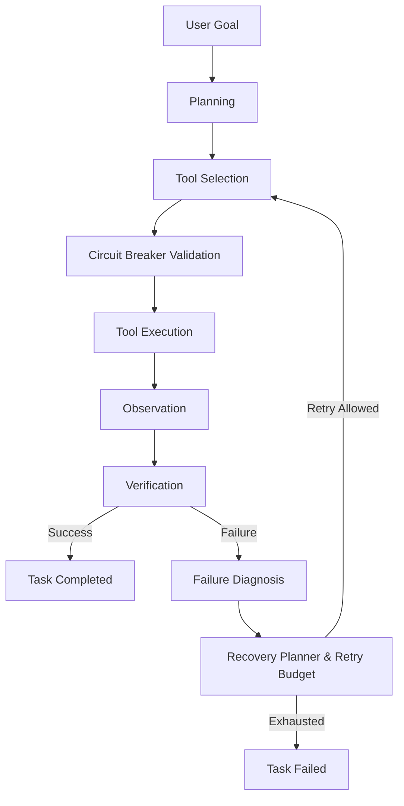

# AgentOS

> An autonomous AI agent execution platform with planning, tool execution, verification, recovery, long-term memory, RAG, tracing, and evaluation.

AgentOS is an advanced orchestration framework designed to elevate AI agents beyond simple chatbots. Instead of a basic request-response loop, AgentOS executes complex tasks by leveraging a dynamic tool registry, verifying outcomes, diagnosing failures, and recovering autonomously. It maintains persistent semantic memory, retrieves knowledge using Retrieval-Augmented Generation (RAG), records structured execution traces, and evaluates agent behavior deterministically.

## Tech Stack

| Technology | Purpose |
|------------|---------|
| **Python 3.11+** | Core language |
| **Pydantic** | Strict data modeling, tool schemas, and validation |
| **FastAPI** | REST API framework for agent endpoints |
| **LiteLLM** | Provider-agnostic LLM interface |
| **ChromaDB** | Persistent vector database for long-term memory |
| **ONNX** | Local embeddings without external API dependencies |
| **PyPDF / BeautifulSoup** | Document ingestion and web extraction |
| **Pytest** | Test-driven verification framework |

## Why AgentOS?

Traditional LLM applications rely on a simple loop: **User → LLM → Response**. If the LLM hallucinates or encounters an error, the execution fails entirely.

AgentOS introduces a resilient engineering architecture:



At every step, AgentOS maintains state, persists semantic knowledge, emits structured traces, and evaluates performance.

## Core Capabilities

| Capability | What AgentOS Provides |
|------------|-----------------------|
| **Task Planning** | Decomposes high-level goals into dependency-aware execution graphs. |
| **Tool Execution** | Dynamically loads and securely executes functions from a Tool Registry. |
| **Verification** | Critically evaluates tool observations against intended goals. |
| **Failure Diagnosis** | Analyzes exceptions and unexpected outputs to determine root causes. |
| **Recovery / Replanning** | Generates alternative execution strategies when tasks fail. |
| **Retry Budgets & Circuit Breakers** | Prevents infinite LLM loops and enforces execution limits. |
| **Long-Term Memory & RAG** | Persists execution context to ChromaDB for semantic retrieval. |
| **Document Ingestion** | Extracts and chunks content from TXT, MD, and PDF files. |
| **Structured Tracing** | Records detailed execution lifecycles to JSONL with credential redaction. |
| **Evaluation Framework** | Tests agent behavior deterministically across simulated edge cases. |
| **REST APIs** | Exposes orchestration, memory management, and evaluation over HTTP. |
| **Workspace Security** | Sandboxes file operations and blocks path traversal attempts. |

## Architecture

AgentOS is highly modular, decoupling planning, memory, execution, and verification.

```text
src/
├── api.py                  # FastAPI entry point
├── config.py               # Environment and settings management
├── evaluation/             # Deterministic testing framework
├── execution/              # Secure tool dispatch and observation
├── llm/                    # Agnostic LLM client wrapper
├── memory/                 # Short-term scratchpad and ChromaDB vector store
├── orchestration/          # Core execution lifecycle and state management
├── planning/               # Goal decomposition and tool selection
├── rag/                    # Chunking, ingestion, and semantic retrieval
├── recovery/               # Diagnostics, replanning, and circuit breakers
├── tools/                  # Extensible Tool Registry and implementations
├── tracing/                # Structured event logging and redaction
└── verification/           # Outcome auditing and validation
```

## Agent Execution Flow

The `Orchestrator` manages the lifecycle without hardcoding logic, passing state between specialized engines:

1. **Goal**: The system receives a user goal.
2. **Planner**: Decomposes the goal into manageable tasks.
3. **Tool Selection**: An appropriate tool is selected from the `ToolRegistry`.
4. **Circuit Breaker**: Validates the selected tool against recent history to prevent looping.
5. **Executor**: Executes the tool within secure boundaries.
6. **Observation**: Captures the raw output or exception.
7. **Verification**: Assesses whether the observation fulfills the task's expected output.
8. **Success / Failure Handling**:
   - *Success*: Marks the task as completed.
   - *Failure*: Routes to the **Failure Diagnosis Engine**, then to the **Recovery Planner**. If the retry budget allows, the task is retried with a revised strategy.

## Phase Breakdown

AgentOS was developed iteratively, ensuring each layer was fully verified before advancing.

| Phase | Major Capability | Status |
|-------|------------------|--------|
| Phase 1 | Core Execution & Architecture | ✅ Completed |
| Phase 2 | Tooling & Security | ✅ Completed |
| Phase 3 | Verification & Autonomous Recovery | ✅ Completed |
| Phase 4 | Long-Term Memory & RAG | ✅ Completed |
| Phase 5 | Tracing & Deterministic Evaluation | ✅ Completed |

## Long-Term Memory & RAG

AgentOS features a fully integrated Retrieval-Augmented Generation pipeline. 
- **ChromaDB Persistence:** Semantic memory is stored locally via a configurable `VECTOR_DB_PATH`.
- **Local Embeddings:** Uses local ONNX embedding models by default, eliminating the need for paid external embedding APIs.
- **Document Ingestion:** Natively supports chunking and indexing for TXT, MD, and PDF files.
- **Memory Tools:** Agents can explicitly store, search, and delete memories during execution.

## Verification & Recovery

Rather than relying on a secondary execution framework, recovery is deeply integrated into the main orchestrator:
- **VerificationEngine:** Audits tool outputs for correctness.
- **FailureDiagnosisEngine:** Categorizes errors (e.g., File Not Found, Validation Error).
- **RecoveryPlanner:** Generates alternative strategies without restarting the entire execution.
- **CircuitBreaker:** Monitors action history to break out of infinite AI loops.

## Tracing

AgentOS emits rich lifecycle events (e.g., `RUN_STARTED`, `TOOL_EXECUTION_STARTED`, `FAILURE`, `RUN_COMPLETED`) via a specialized `TraceEvent` model.
- **LocalTracer:** Persists traces to JSONL files for observability.
- **Credential Redaction:** Automatically scrubs passwords, API keys, and tokens from traces before persistence.
- **Run Correlation:** Associates all events with a unique `run_id` and specific `task_id`s.

## Evaluation

The platform includes an evaluation framework designed to test AI behavior deterministically:
- Evaluates individual `TestCase` configurations against the Orchestrator.
- Validates expected tool usage, final task statuses, and expected file system side-effects.
- Generates a comprehensive `EvalReport` with duration, tool counts, and recovery metrics.

**Current Verification:** 49/49 tests passing.

## API

The system exposes its capabilities via a FastAPI interface.

### Orchestration & Execution
- `GET /health` - System status and environment.
- `GET /tools` - Lists all registered tool schemas.
- `POST /tools/execute` - Executes a single tool manually.
- `POST /tasks/execute` - Executes a task through the full orchestration and recovery loop.

### Memory & RAG (Phase 4)
- `POST /memory/store` - Stores semantic text manually.
- `POST /memory/search` - Retrieves memories via vector search.
- `POST /memory/delete` - Deletes a specific memory record.
- `GET /memory/count` - Returns the total stored vector count.
- `POST /rag/ingest` - Ingests and chunks a document from the local filesystem.
- `POST /rag/search` - Queries the RAG pipeline.

### Tracing & Evaluation (Phase 5)
- `GET /traces/{task_id}` - Retrieves all tracing events for a given task or run.
- `POST /evaluate` - Runs a suite of deterministic test cases and returns an evaluation report.

## Security

AgentOS is designed with AI-specific security boundaries:
- **Path Traversal Prevention:** Filesystem tools validate operations against the `workspace/` root.
- **Credential Redaction:** The tracing subsystem actively scrubs sensitive strings.
- **Isolated State:** Evaluation and execution run in distinct memory contexts.
- **Local By Default:** The vector store operates locally without external data exfiltration.

## Testing

The project maintains strict test-driven integrity.

```bash
pytest -v -W default
```

- **Status:** 49 tests passed.
- **Coverage:** Phases 1–5 regression coverage.
- *Note: The 3 remaining warnings are standard third-party deprecation notices (Starlette/ChromaDB), not AgentOS issues.*

## Manual Verification

Beyond unit tests, the following behaviors have been manually verified:
- RAG document ingestion and semantic retrieval accuracy.
- Path traversal rejection via filesystem tools.
- Vector database persistence across application restarts.
- Trace JSONL formatting and API retrieval.
- `RUN_COMPLETED` emission for both successful and failed execution graphs.
- Autonomous credential redaction in output logs.

## Installation / Quick Start

1. **Clone the repository:**
   ```bash
   git clone https://github.com/vivekkumarroy/AgentOS.git
   cd AgentOS
   ```

2. **Create a virtual environment:**
   ```bash
   python -m venv venv
   # Windows:
   venv\Scripts\activate
   # Unix/macOS:
   source venv/bin/activate
   ```

3. **Install requirements:**
   ```bash
   pip install -r requirements.txt
   ```

4. **Configure environment:**
   Copy `.env.example` to `.env` and set your preferred LLM provider keys.

5. **Run the API server:**
   ```bash
   uvicorn src.api:app --reload
   ```

## Example API Usage

**Executing a Task with Recovery:**
```bash
curl -X POST http://localhost:8000/tasks/execute \
-H "Content-Type: application/json" \
-d '{
  "task": {
    "task_id": "task_01",
    "description": "Write a summary to summary.txt",
    "dependencies": [],
    "required_tools": ["write_file"],
    "expected_output": "File successfully written"
  }
}'
```

**Querying the RAG Pipeline:**
```bash
curl -X POST http://localhost:8000/rag/search \
-H "Content-Type: application/json" \
-d '{
  "query": "What is AgentOS?",
  "top_k": 3
}'
```

## Engineering Highlights

- **Modular Architecture:** Clean separation of concerns between planning, execution, verification, and recovery.
- **Persistent Vector Memory:** ChromaDB integrated directly into the agent lifecycle.
- **Deterministic Evaluation:** Testing framework that guarantees predictable agent behaviors.
- **Structured Tracing:** Enterprise-grade observability into the AI decision loop.
- **Circuit Breaker Protection:** Robust defenses against LLM hallucinations and infinite loops.
- **Security-Aware Design:** Built-in path validation and credential scrubbing.

## Limitations

- **Sequential Processing:** The evaluation framework and trace querying currently operate sequentially.
- **Third-Party Deprecations:** Emits minor deprecation warnings from `httpx`/`starlette` and `chromadb` under Python 3.14.

## License

*(This project currently operates without an explicit open-source license. All rights reserved by the original author.)*
